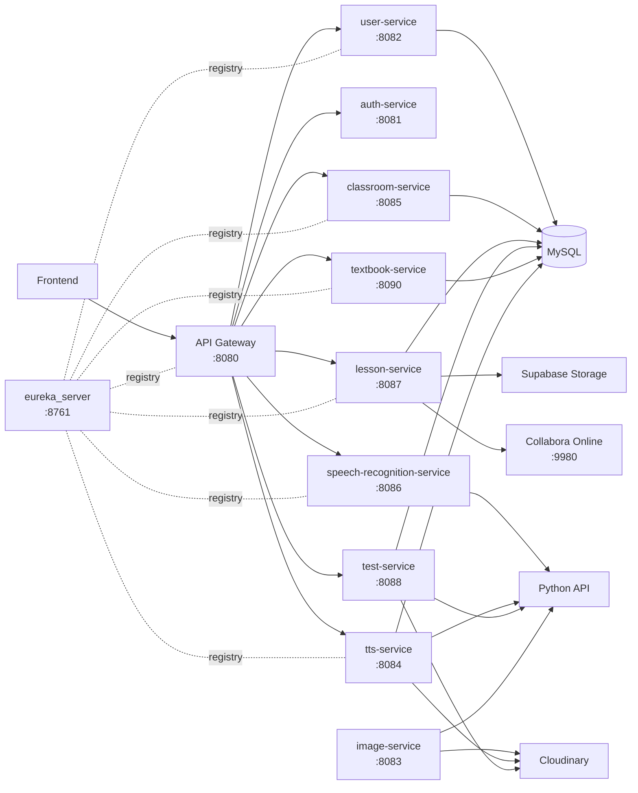

<a id="readme-top"></a>

<div align="center">

# PrimarySchoolTeacherSupportSystemBackend

## Hệ Thống Hỗ Trợ Giáo Viên Tiểu Học Tạo Bài Giảng Tích Hợp AI

Backend microservices cho nền tảng hỗ trợ giáo viên tiểu học trong quản lý người dùng, lớp học, bài giảng, đề kiểm tra, sách giáo khoa và các tính năng AI/media.

<p>
  
  
  
  
  
</p>

<p>
  <a href="#tong-quan">Tổng quan</a>
  ·
  <a href="#diem-noi-bat">Điểm nổi bật</a>
  ·
  <a href="#kien-truc">Kiến trúc</a>
  ·
  <a href="#module">Module</a>
  ·
  <a href="#chay-local">Chạy local</a>
</p>

### Nhóm thực hiện

| Họ và tên | Mã số sinh viên |
| :--- | :---: |
| **Nguyễn Quốc Tấn** | `22130248` |
| **Đặng Anh Nguyên** | `22130188` |

</div>

---

## Tổng quan

`PrimarySchoolTeacherSupportSystemBackend` là backend được tổ chức theo kiến trúc microservices, tách từng miền nghiệp vụ thành service độc lập. Hệ thống sử dụng Spring Cloud Gateway làm điểm vào chung, Eureka làm service registry, MySQL làm tầng lưu trữ chính và tích hợp các dịch vụ hỗ trợ như Google OAuth2, SMTP mail, Cloudinary, Supabase Storage, Collabora Online/WOPI và Python API xử lý AI/media.

Mục tiêu của backend là tạo nền tảng ổn định cho một hệ thống giáo dục có nhiều nhóm chức năng: xác thực, quản lý lớp học, soạn/chia sẻ bài giảng, tạo đề kiểm tra, lưu trữ sách giáo khoa, tạo giọng nói, kiểm tra phát âm và tạo ảnh minh họa.

<p align="right"><a href="#readme-top">Lên đầu trang</a></p>

## Điểm nổi bật

### Kiến trúc tốt cho mở rộng

- Tách domain rõ ràng theo từng microservice.
- Có Gateway làm cổng vào thống nhất cho frontend.
- Có Eureka Service Discovery để các service đăng ký và giao tiếp theo service name.
- Có thể build, chạy và debug từng service độc lập.

### Nghiệp vụ giáo dục đầy đủ

- Quản lý người dùng, hồ sơ cá nhân, vai trò và danh mục.
- Quản lý lớp học, thành viên, lời mời qua email, link mời, mã lớp và roster.
- Quản lý bài giảng dạng draft/template, chia sẻ cho người dùng hoặc lớp học.
- Quản lý đề kiểm tra, câu hỏi, lượt làm bài, thống kê và xuất DOCX.
- Quản lý sách giáo khoa và dữ liệu trang sách.

### Tích hợp AI/media thực tế

- Text-to-Speech cho chuyển văn bản thành giọng nói.
- Speech Recognition cho kiểm tra phát âm.
- Image Generation cho tạo ảnh minh họa.
- Cloudinary cho lưu trữ ảnh/audio.
- Supabase Storage và Collabora Online/WOPI cho tài liệu bài giảng.

### Nền tảng kỹ thuật vững

- Spring Boot 3.4.1, Java 17, Spring Cloud 2024.0.0.
- Maven multi-module giúp quản lý toàn bộ backend trong một workspace.
- Spring Data JPA và MySQL cho tầng dữ liệu.
- Spring Security, JWT, OTP email và Google OAuth2 cho xác thực.
- Apache POI và Python API hỗ trợ xử lý file/tài liệu.

<p align="right"><a href="#readme-top">Lên đầu trang</a></p>

## Kiến trúc




<p align="right"><a href="#readme-top">Lên đầu trang</a></p>

## Module

| Module | Port mặc định | Vai trò chính |
| --- | ---: | --- |
| `eureka_server` | `8761` | Service registry cho hệ thống microservices. |
| `api-gateway` | `8080` | Gateway định tuyến API, cấu hình CORS và điểm vào chung cho frontend. |
| `user-service` | `8082` | Đăng ký, đăng nhập, OTP, Google OAuth2, hồ sơ người dùng, quản trị user/category. |
| `auth-service` | `8081` | Service xác thực riêng; gateway hiện route `/api/auth/hello` tới service này. |
| `classroom-service` | `8085` | Lớp học, thành viên, lời mời, mã lớp, roster, bài đăng lớp học và import Excel. |
| `lesson-service` | `8087` | Bài giảng, draft, template, chia sẻ, Collabora/WOPI và Supabase Storage. |
| `test-service` | `8088` | Đề kiểm tra, câu hỏi, lượt làm bài, thống kê, nội dung bài học và xuất DOCX. |
| `textbook-service` | `8090` | Sách giáo khoa và dữ liệu trang sách. |
| `tts-service` | `8084` | Chuyển văn bản thành giọng nói, upload/lưu audio, quản lý lịch sử audio. |
| `speech-recognition-service` | `8086` | Kiểm tra phát âm dựa trên văn bản mục tiêu và audio upload. |
| `image-service` | `8083` | Tạo ảnh, lưu lịch sử ảnh và quản lý ảnh đã tạo. |

<p align="right"><a href="#readme-top">Lên đầu trang</a></p>

## Tech stack

| Nhóm | Công nghệ |
| --- | --- |
| Language | Java 17 |
| Build | Maven, Maven Wrapper, Maven multi-module |
| Core Framework | Spring Boot 3.4.1 |
| Microservices | Spring Cloud 2024.0.0, Eureka, Spring Cloud Gateway |
| API | Spring Web, Spring Validation |
| Persistence | MySQL, Spring Data JPA, Hibernate |
| Security | Spring Security, JWT, Google OAuth2 |
| Messaging/Email | Spring Mail, SMTP |
| Storage/Media | Cloudinary, Supabase Storage |
| Document Editing | Collabora Online, WOPI |
| File Processing | Apache POI |
| Service Communication | RestTemplate, OpenFeign |

## Cấu trúc thư mục

```text
.
+-- api-gateway/
+-- auth-service/
+-- classroom-service/
+-- eureka_server/
+-- image-service/
+-- lesson-service/
+-- speech-recognition-service/
+-- test-service/
+-- textbook-service/
+-- tts-service/
+-- user-service/
+-- .env.example
+-- docker-compose.collabora.yml
+-- pom.xml
```

## Route API qua Gateway

| Prefix | Service |
| --- | --- |
| `/api/auth/login`, `/api/auth/register`, `/api/auth/send-otp`, `/api/auth/verify-otp` | `user-service` |
| `/api/user/**` | `user-service` |
| `/api/admin/users/**`, `/api/admin/categories/**` | `user-service` |
| `/oauth2/**`, `/login/oauth2/**` | `user-service` |
| `/api/internal/users/**` | `user-service` |
| `/api/auth/hello` | `auth-service` |
| `/api/classrooms/**`, `/api/student/**`, `/api/admin/classrooms/**`, `/api/internal/classrooms/**`, `/api/internal/invitations/**` | `classroom-service` |
| `/api/lessons/**` | `lesson-service` |
| `/api/tests/**` | `test-service` |
| `/api/textbooks/**` | `textbook-service` |
| `/api/tts/**` | `tts-service` |
| `/api/pronunciation/**` | `speech-recognition-service` |

<p align="right"><a href="#readme-top">Lên đầu trang</a></p>

## Chạy local

### Yêu cầu

- JDK 17.
- MySQL.
- Maven Wrapper có sẵn trong project.
- Python API ngoài workspace nếu dùng TTS, tạo ảnh, kiểm tra phát âm hoặc xuất DOCX.
- Collabora Online nếu dùng chức năng chỉnh sửa tài liệu trong `lesson-service`.

### Cấu hình môi trường

Tạo `.env` từ file mẫu:

```powershell
Copy-Item .env.example .env
```

Các nhóm cấu hình chính:

- `EUREKA_DEFAULT_ZONE`
- `JWT_SECRET`, `JWT_EXPIRATION_MS`
- `GOOGLE_CLIENT_ID`, `GOOGLE_CLIENT_SECRET`
- `AUTH_DB_*`, `USER_DB_*`, `CLASSROOM_DB_*`, `LESSON_DB_*`, `TEXTBOOK_DB_*`
- `AUTH_MAIL_*`, `USER_MAIL_*`, `CLASSROOM_MAIL_*`
- `COLLABORA_DISCOVERY_URL`, `COLLABORA_WOPI_PUBLIC_URL`, `COLLABORA_ASSET_PUBLIC_URL`
- `SUPABASE_URL`, `SUPABASE_KEY`, `SUPABASE_BUCKET`
- `CLOUDINARY_CLOUD_NAME`, `CLOUDINARY_API_KEY`, `CLOUDINARY_API_SECRET`

Không commit `.env` hoặc secret thật lên repository.

### Build

```powershell
.\mvnw clean install
```

### Chạy service nền tảng

```powershell
.\mvnw -pl eureka_server spring-boot:run
.\mvnw -pl api-gateway spring-boot:run
```

### Chạy service nghiệp vụ

```powershell
.\mvnw -pl user-service spring-boot:run
.\mvnw -pl classroom-service spring-boot:run
.\mvnw -pl lesson-service spring-boot:run
.\mvnw -pl test-service spring-boot:run
.\mvnw -pl textbook-service spring-boot:run
.\mvnw -pl tts-service spring-boot:run
.\mvnw -pl speech-recognition-service spring-boot:run
.\mvnw -pl image-service spring-boot:run
```

### Chạy Collabora bằng Docker

```powershell
docker compose -f docker-compose.collabora.yml up -d
```

Dừng Collabora:

```powershell
docker compose -f docker-compose.collabora.yml down
```

<p align="right"><a href="#readme-top">Lên đầu trang</a></p>

## Lệnh thường dùng

| Mục đích | Lệnh |
| --- | --- |
| Build toàn bộ | `.\mvnw clean install` |
| Test toàn bộ | `.\mvnw test` |
| Test một module | `.\mvnw -pl <ten-module> test` |
| Chạy một module | `.\mvnw -pl <ten-module> spring-boot:run` |
| Chạy module kèm dependency | `.\mvnw -pl <ten-module> -am spring-boot:run` |
| Chạy Collabora | `docker compose -f docker-compose.collabora.yml up -d` |

## Database

Dự án sử dụng MySQL và Spring Data JPA. Các service chủ yếu cấu hình Hibernate `ddl-auto=update`.

Một số SQL thủ công có trong source:

- `classroom-service/src/main/resources/init-classroom-db.sql`
- `image-service/database/schema.sql`

Các nhóm bảng/entity nổi bật:

| Nhóm | Bảng/entity |
| --- | --- |
| Người dùng | `users`, `roles`, `teacher_classes`, `student_info`, `categories` |
| Lớp học | `classrooms`, `classroom_members`, `classroom_invitations`, `classroom_posts`, `classroom_post_attachments` |
| Bài giảng | `lesson_templates`, `lesson_drafts`, `lesson_shares`, `lesson_classroom_shares` |
| Đề kiểm tra | `tests`, `test_questions`, `test_attempts`, `lesson_contents` |
| Media và SGK | `audio_records`, `image_records`, `books`, `pages` |

## Giá trị kỹ thuật

| Giá trị | Ý nghĩa |
| --- | --- |
| Dễ mở rộng | Thêm domain mới bằng cách bổ sung microservice và route gateway. |
| Dễ bảo trì | Mỗi service tập trung vào một nhóm nghiệp vụ riêng. |
| Dễ tích hợp AI | Các chức năng TTS, pronunciation và image generation đã được tách riêng. |
| Phù hợp giáo dục | Bao phủ nhiều nghiệp vụ cốt lõi: lớp học, bài giảng, kiểm tra, sách giáo khoa và media. |
| Linh hoạt khi phát triển | Có thể chạy từng module độc lập để debug và kiểm thử. |

## Ghi chú bảo mật

- Không đưa secret thật vào README, log hoặc commit.
- Nên cấu hình khóa Google, Cloudinary, Supabase và JWT qua biến môi trường.
- Khi thay đổi route hoặc security, cần kiểm tra đồng thời Gateway, service đích và frontend/client đang gọi API.

---

<div align="center">

Backend for **Hệ Thống Hỗ Trợ Giáo Viên Tiểu Học Tạo Bài Giảng Tích Hợp AI**

</div>

